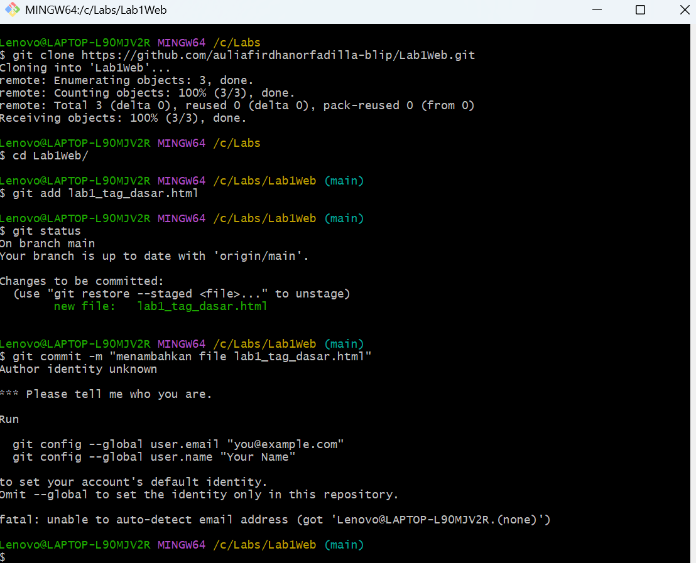
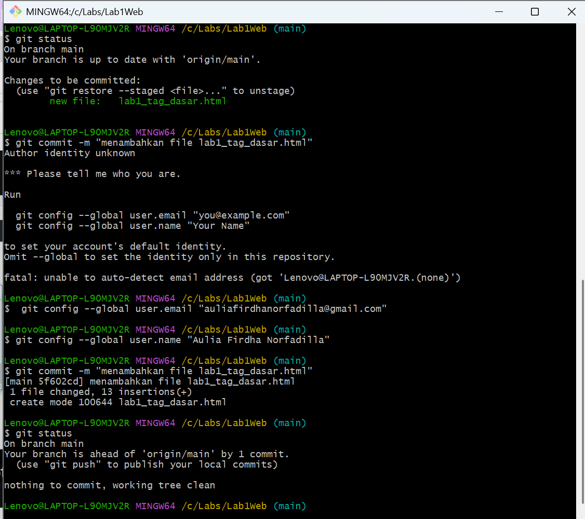
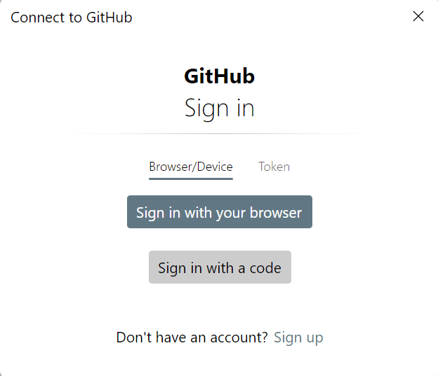
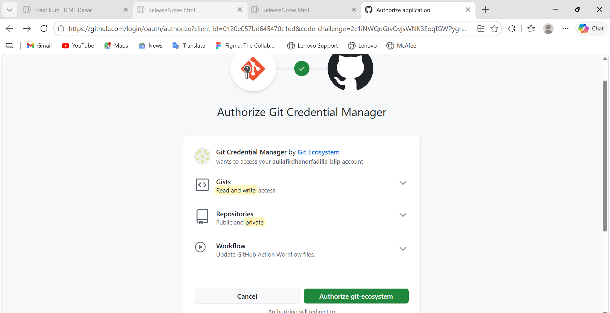

# Lab1Web
## Belajar Tag-Tag Dasar HTML

### Membuat Paragraf
Kode tag pada paragraf adalah 

Ini adalah tampilannya

Lalu buka git=scm 

Ketikkan seperti gambar dibawah ini

Setelah itu, akan muncul layar seperti ini :

Berikutnya, klik Sign In With Your Browser 

Lalu masuk melalui akun google 

dan klik Autorized git-ecosystem

Dan setelahnya, muncul halaman seperti ini di GitHub 

Itu tandanya kalian sudah berhasil membuat Git Version Control menggunakan GitHub
